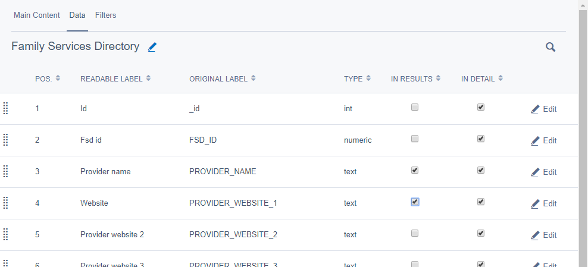
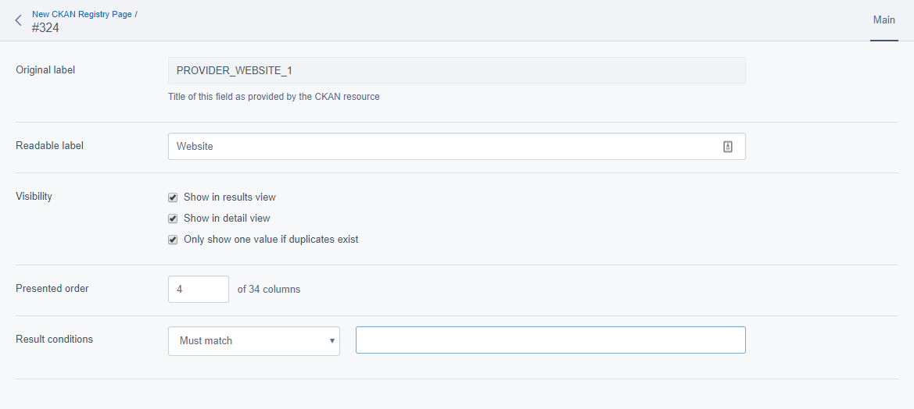
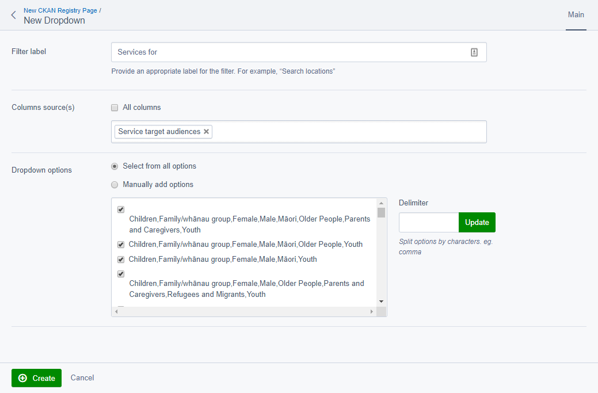

# CKAN Registry

The CKAN Registry module adds a new page type to the CMS, allowing a content editor to add pages that display data coming from an external CKAN resource in a table format to website visitors.

> For the purpose of this help text we will reference [data.govt.nz](https://catalogue.data.govt.nz) as our CKAN instance. This could easily be any CKAN instance that has API access enabled.

After creating a new CKAN Registry Page, the normal page editing options are available to the content editor, along with a new tab called "Data". This tab will allow one to paste a CKAN datastore resource URL into the "Data source URL" field.

This field will then load data from CKAN, providing a list of resources available on that dataset if applicable, and pre-selecting one if the URL was for a resource rather than a dataset.

Once a valid resource has been chosen, and the page saved, SilverStripe will import a list of all the fields available on that resource, listing them down the page, and a new tab will appear for the page - "Filters".

To change the resource after the page has been saved, click the pencil icon next to the dataset title. **Changing the resource and saving the page will reset _all_ configuration to defaults.**

The list of fields by default has quick references for "Results" and "Detail", the former disabled by default and the latter enabled by default for all records. These two options will be explained in detail in the next section.

> **Note** There must be at least one record with the "Results" column ticked, or no data will be displayed to visitors.

Configuration:

Results on the page:

## Fields

The list of fields will be shown to a visitor as columns on the table, and there are a number of options available to the CMS editor to configure.

Each field can be configured as such:

* The **Original label** is not editable, and serves to indicate the source of the data as coming from the CKAN resource.
* The **Readable label** allows the label/name to be altered to be more readable if the one imported from CKAN is undesirable for any reason.
* If **Show in results view** is checked, this field will be shown as a column on the field site visitors will see, otherwise it will not be shown. At least one field must be selected to be shown to the user.
* If **Show in detail view** is checked, this field will be shown in the detail view that opens when a visitor clicks a row on the table shown to them. This is enabled for all fields by default.
* If **Only show one value if duplicates exist** removes one of two (or more) results that have the same data in the result set shown to the website visitor.
* **Presented order** allows an editor to change the ordering of columns with more precision than dragging and dropping items in the CMS table. This also makes it easy to move items between pages.
* The **Result conditions** allow for a "pre-filter" to be chosen to only show results matching (or not matching) a particular value.

## Filters:
The filters tab allows a CMS content editor to configure fields shown to a visitor that will allow them to search the results shown to them. One is always created by default after selecting a resource and saving the page. This default filter is a text type that searches all columns for matches on the visitor's search term.

By default there are two types of filters available to a content editor to configure, text and dropdown. The text filter allows a user to enter text to filter results. The dropdown filter only allows a pre-defined value to be chosen.

### Configuring a text filter:

* A **Filter label** can be given to indicate what type of search the content editor configures it to do.
* **Column sources** allow the filter to be configured to either search all columns, or if the checkbox is unchecked to search only a particular column or set of columns (multiple may be chosen).

### Configuring the dropdown filter:

This filter type has only one extra configuration option from those provided by the text filter; the ability to supply filter options for the user to choose from. There are two methods available to define options, however only the chosen method is used (the two cannot be combined).

#### Options

After choosing which columns the filter will apply to, the **Select from all options** area will update to provide a list of all possible unique values those columns contain. The content editor can then choose to disable any of these options by un-checking the corresponding checkbox.

#### Delimiter

In some cases, multiple values are contained in a single column on a row. For example, in the _Family Services Directory_ we can see a _`SERVICE_TARGET_AUDIENCES`_ column that contains multiple values on some rows, separated by a comma (e.g. "Children,Youth").

To get these values to display as both "Children" and "Youth" we can enter a comma into the **Delimiter** box; after clicking **Update** the list of options to will update to be separated appropriately.

#### Manual selection

The **Manually add options** entry box for this allows values to be entered directly by the content editor, one option per line.

E.g.

    Children
    Older People
    Parents and Caregivers

This option is available for cases where it might be easier to list out known values in advance, rather than to enable or disable provided values individually.

Configuring a dropdown filter manually:

What this looks like to visitors, using this modules default presentation:

